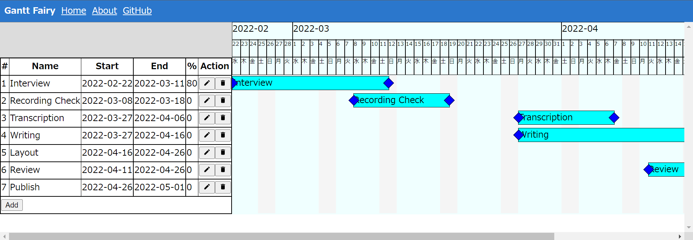

# ganttfairy

Web App for easy-creating gantt chat.



## Project setup
```
npm install
```

### Compiles and hot-reloads for development
```
npm run serve
```

### Compiles and minifies for production
```
npm run build
```

### Run your unit tests
```
npm run test:unit
```

### Lints and fixes files
```
npm run lint
```

### Customize configuration
See [Configuration Reference](https://cli.vuejs.org/config/).

## LICENSE
All source codes I wrote are under public domain (Unlicense).
However, some third party libraries are NOT under public domain, so please pay attention when you employ those source codes into your products.
